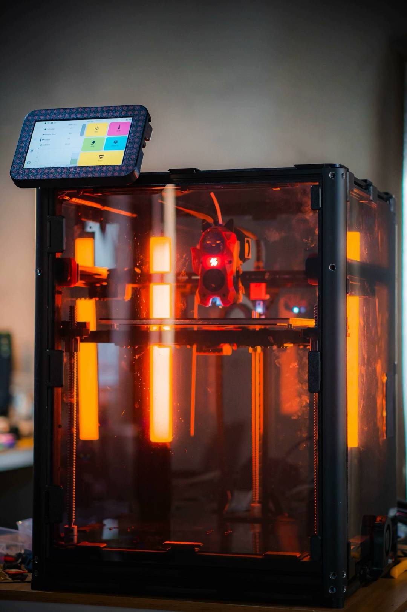

# TORON



TORON is a 300x300x300 CoreXY printer primarily featuring components from other projects:

* [Voron Trident](https://github.com/VoronDesign/Voron-Trident)

## BOM

### Frame

```
4x HFS5-4040-550-SC-LCP-RCP-AV360
9x HFS5-2040-370-TPW-SC
1x HFS5-2040-370-TPW-SC-AH185
1x HFS5-2040-330-TPW-SC
1x HFS5-2020-240-SC
1x HFS5-2020-370-SC
```